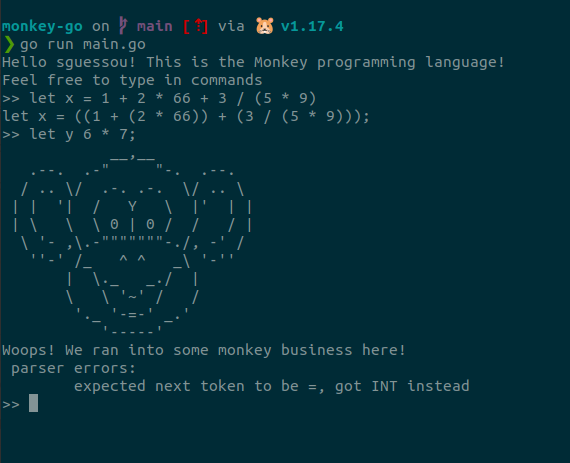

# monkey-go
Learning how to write an Interpreter called `Monkey` using Go!

If you're interested in learning about interpreters and compilers head off [here -> Writing An Interpreter In Go by Thorsten Ball](https://thorstenball.com/books/)

Big shout-out to Thorsten Ball for writing the books!!!

Load the `monkey-go` interpreter by running `go run main.go` at the terminal.

