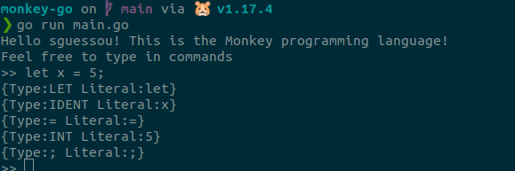

# monkey-go
Learning how to write an Interpreter called `Monkey` using Go!

If you're interested in learning about interpreters and compilers head off [here -> Writing An Interpreter In Go by Thorsten Ball](https://thorstenball.com/books/)

Big shout-out to Thorsten Ball for writing the books!!!

The lexer for `monkey-go` can be tried out at the `REPL` by running this command at the root directory: `go run main.go`

Enter the statement `let x = 5;` into the lexer and press Enter to get the tokens.

